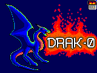

[](https://www.patreon.com/bePatron?u=4656145)
[](https://ci.appveyor.com/project/drako0812/drak-0)



# DRAK-0
A fantasy console written in C++ using SFML and using ChaiScript for scripting.

## Community Links
- [Google Group Forum](https://groups.google.com/forum/#!forum/drak-0)
- [Google+ Community](https://plus.google.com/communities/104848103715411845349?sqinv=R2NnUTc1UmNibjRQX1NzeHRrOGZxQW1PTXBGTWln)

## Technical Information

**NOTE: these are intended features, they are not yet available.**

- [ ] DRAK-0 has a 320x240 6-bit screen.
- [ ] The palette has 64 colors and is customizable.
- [ ] It has 5 256x256 pixel sprite banks with a default intent of:
  - Bank 0 --> Custom Font
  - Banks 1-2 --> Background Sprites
  - Banks 3-4 --> Foreground Sprites
- [ ] It has an 8x8 map bank each containning a 40x30 8x8 sprite map
- [ ] It has a 256 KiB code bank
- [ ] It has a 64 KiB data bank (for storing save data)
- [ ] It has support for simultaneous:
  - [ ] 2 gamepads (d-pad, a, b, x, y, start, select)
  - [ ] 2 2-button mice
- [ ] Scripting supported through ChaiScript

## Building (Visual Studio 2017)
**NOTE: Currently this is the only build option available.**

The repo contains a Solution file "DRAK-0.sln" and the folder "DRAK-0" contains the actual project "DRAK-0.vcxproj" and its
resources. This is done in case additional apps are created to go along with DRAK-0.

You should just be able to build and run it. Easy peasy. :)

### Dependencies

#### Vcpkg Dependencies

1. [SFML](https://github.com/SFML/SFML) I've switched over to using [vcpkg](https://github.com/Microsoft/vcpkg) for depending on SFML.
   NOTE: To use them yourself you will need to install vcpkg and install SFML using one or all of the following:

   ```batch
   vcpkg install sfml:x86-windows-static
   vcpkg install sfml:x64-windows-static
   ```

#### Other Dependencies

1. [ChaiScript](https://github.com/ChaiScript/ChaiScript) this is added into the repo manually from github.
2. [Boost.Nowide](https://github.com/artyom-beilis/nowide) this is added into repo manually from github.
3. [randutils](https://gist.github.com/imneme/540829265469e673d045) this is added into the repo manually from github.
 
## Licensing

```
The MIT License (MIT)

Copyright (c) 2017 Drew Wibbenmeyer

Permission is hereby granted, free of charge, to any person obtaining a copy
of this software and associated documentation files (the "Software"), to deal
in the Software without restriction, including without limitation the rights
to use, copy, modify, merge, publish, distribute, sublicense, and/or sell
copies of the Software, and to permit persons to whom the Software is
furnished to do so, subject to the following conditions:

The above copyright notice and this permission notice shall be included in all
copies or substantial portions of the Software.

THE SOFTWARE IS PROVIDED "AS IS", WITHOUT WARRANTY OF ANY KIND, EXPRESS OR
IMPLIED, INCLUDING BUT NOT LIMITED TO THE WARRANTIES OF MERCHANTABILITY,
FITNESS FOR A PARTICULAR PURPOSE AND NONINFRINGEMENT. IN NO EVENT SHALL THE
AUTHORS OR COPYRIGHT HOLDERS BE LIABLE FOR ANY CLAIM, DAMAGES OR OTHER
LIABILITY, WHETHER IN AN ACTION OF CONTRACT, TORT OR OTHERWISE, ARISING FROM,
OUT OF OR IN CONNECTION WITH THE SOFTWARE OR THE USE OR OTHER DEALINGS IN THE
SOFTWARE.
```

Also, some code is based off of [SDL2_gfx](http://www.ferzkopp.net/wordpress/2016/01/02/sdl_gfx-sdl2_gfx/).
